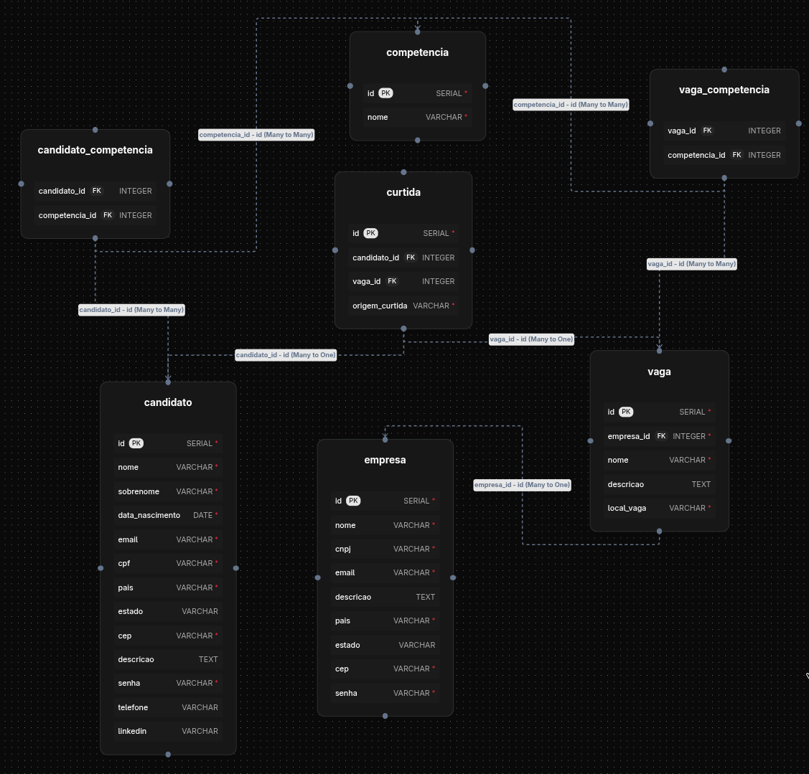

# Linketinder

## Tecnologias Utilizadas
- Groovy 5.0
- JVM 25

## Build e Execução
```bash
./gradlew build
./gradlew run --console=plain
```

## Estrutura do Projeto
```
src/
├── Main.groovy
├── model/    # Entidades do domínio
└── service/  # Lógica de negócio
```

## Frontend

### Tecnologias Utilizadas
- Chart.js (CDN)

### Features TypeScript Utilizadas
- Interfaces para tipagem de dados (Candidato, Empresa, Vaga, CurrentUser)
- Namespace para organização das funções de armazenamento
- Generics com Omit para operações de criação
- Type assertions para manipulação do DOM
- Módulos ES6 para importação/exportação
- Validações utilizando regex nativo do TypeScript

### Como Executar
1. Compile o TypeScript com `tsc`
2. Abra o arquivo `frontend/index.html` com um servidor local (ex: Live Server)
3. Os dados são salvos automaticamente no localStorage

## Banco de Dados



### Tecnologias Utilizadas
- PostgreSQL
- Docker (Compose)

### Como Executar
```bash
cd db
docker-compose up -d
docker exec -it linketinder_postgres psql -U admin -d linketinder # Testar queries
```

Feito por Ângelo.